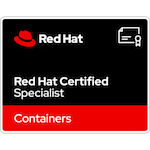
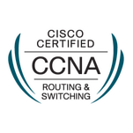
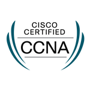
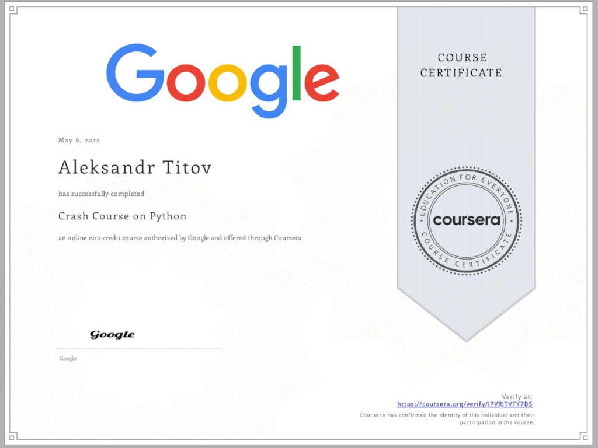

### Hi there 👋

<!--
**alextitov1/alextitov1** is a ✨ _special_ ✨ repository because its `README.md` (this file) appears on your GitHub profile.

Here are some ideas to get you started:

- 🔭 I’m currently working on ...
- 🌱 I’m currently learning ...
- 👯 I’m looking to collaborate on ...
- 🤔 I’m looking for help with ...
- 💬 Ask me about ...
- 📫 How to reach me: ...
- 😄 Pronouns: ...
- ⚡ Fun fact: ...
-->
One day I will update this page with additional information about myself

## Pantheon

### RedHat

[ID: 220-066-641](https://rhtapps.redhat.com/verify?certId=220-066-641)

[EX-200](https://www.credly.com/badges/b6f62196-6210-4c63-a077-a8b5cc72236e/public_url) | [EX-294](https://www.credly.com/badges/e6937583-524c-42df-a13c-415c87c4a2b4/public_url) | [EX-188](https://www.credly.com/badges/290d178c-85e2-4c77-aec4-9d8d0682762f/public_url) | EX-280
:-----:|:------:|:------:|:----------:|
 |  |  |  |

### Cloud

[AZ-104](https://www.credly.com/badges/775480a0-ef71-4c4a-b432-918a5ec34278/public_url)|
:-------------------------:|
  |

[SAA-C02](https://www.credly.com/badges/7c52e231-3a1e-47ef-b6ac-e710fa1e15d2/public_url)|
:-------------------------:|
  |

### Networking

[CCNA R&S](https://www.credly.com/badges/8973359b-c731-4218-8e10-23a8eb0a309b/public_url)| [CCNA](https://www.credly.com/badges/8f6a8f05-8758-4b4f-b6c0-352ec3dfae92/public_url)
:-------------------------:|:----------:|
  | 

MTCNA (1810NA2556)|
:-------------------------:|
  |

### Windows
[MS-410](https://www.credly.com/badges/80f6d7ac-7677-423c-9193-c3f02ef0aee3/public_url)|
:-------------------------:|
  |

### Programming
[Google - Crash Course on Python](https://www.coursera.org/account/accomplishments/verify/J7VRJTVTY7B5)

Coursera cert

